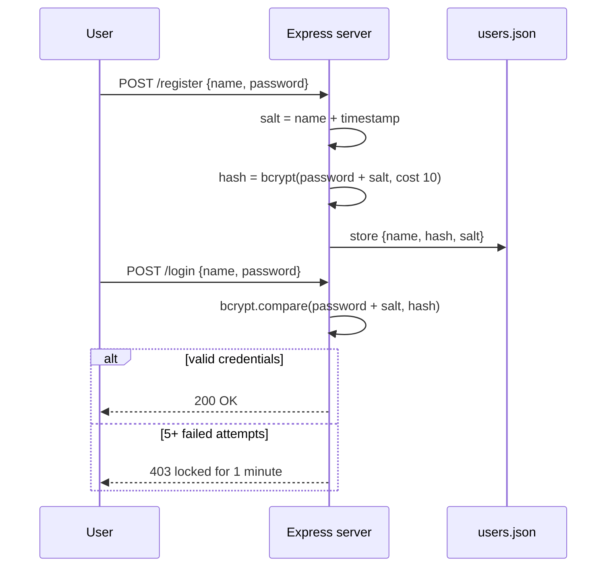

# login-hash — secure auth demo (Node + bcrypt)

A small authentication service that demonstrates **storing passwords the right way** —
never in plaintext. Built with Node.js + Express, it hashes every password with
**bcrypt + a per-user salt** and defends against brute force with **account lockout**.

## Auth flow



## Security features

- **bcrypt hashing** (cost factor 10) — passwords are never stored or compared in plaintext.
- **Per-user salt** (`name + timestamp`) — identical passwords produce different hashes.
- **Brute-force lockout** — 5 failed logins lock the account for 1 minute.
- **Password reset** flow and a simple post-login dashboard.

## Pages

`index.html` (login) · `register.html` · `reset-password.html` · `dashboard.html`

## Run it

```bash
npm install
node server.js
# open http://localhost:3000
```

## Stack

Node.js · Express · bcrypt · body-parser · vanilla HTML / CSS / JS
